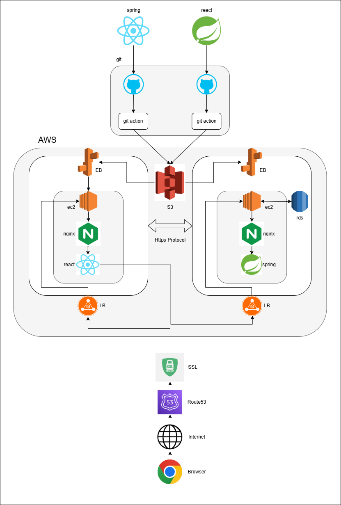

# Horizon

> 온라인 IQ 테스트 웹서비스의 프론트엔드

실제 결제가 이루어지는 상용 서비스로 기획·개발·배포까지 진행한 프로젝트.
<br />
2인 팀(프론트엔드 1, 백엔드 1)으로 진행했으며, 저는 프론트엔드 전반을 담당함.

&nbsp;

## 프로젝트 개요

| 항목            | 내용                                        |
| :-------------- | :------------------------------------------ |
| **기간**        | 2024.09 ~ 2025.03 (약 6개월)                |
| **팀 구성**     | 프론트엔드 1명, 백엔드 1명                  |
| **역할**        | 프론트엔드 전반 (기획 · 설계 · 구현 · 배포) |
| **서비스 상태** | 운영 종료                                   |

&nbsp;

## 기술 스택

- **Core** &nbsp; React 18, React Router v6, JavaScript
- **Styling** &nbsp; Tailwind CSS, Framer Motion
- **State** &nbsp; React Context API
- **HTTP** &nbsp; Axios
- **Payment** &nbsp; NICE Pay SDK
- **Deploy** &nbsp; AWS (EC2, S3, Elastic Beanstalk, RDS, Route53, ALB), GitHub Actions, Nginx
- **기타** &nbsp;Recharts, react-spinners, react-world-flags, @headlessui/react

&nbsp;

## 아키텍처



프론트엔드와 백엔드가 각각 독립된 Elastic Beanstalk 환경에 배포되며, 사용자 요청은 Route53 -> SSL -> ALB를 거쳐 각 EC2 인스턴스의 Nginx로 전달됨.
<br/>
GitHub Actions가 빌드 산출물을 S3에 업로드하면 Elastic Beanstalk가 이를 가져가 각 환경에 배포하는 구조.

&nbsp;

## 주요 구현

### 1. IQ 환산 알고리즘 및 점수 구간별 동적 결과 분기

- 40분 응시 후 정답 수를 IQ로 환산하고, 점수 구간에 따라 서로 다른 해설 화면을 동적으로 렌더함. 응시 중 수집한 점수·답안 데이터와 결제 후 결과 데이터 등은 React Context API로 관리해, 테스트 페이지부터 결제 완료 페이지까지 여러 라우트를 오가는 흐름에서 prop drilling 없이 상태를 공유함.

### 2. NICE Pay 결제 연동

- 결제가 필요한 페이지에 진입했을 때만 NICE Pay SDK를 동적으로 로드해, 불필요한 초기 번들 증가를 방지함. 주문 시 생성한 UUID를 결제 요청의 `orderId`로 전달하여 결제 건과 주문 데이터를 1:1로 매칭하고, 결제 성공/실패 콜백에 따라 조건부 렌더링 및 결과 페이지 자동 라우팅을 처리함.

### 3. 소셜 프루프 기반 진입 유도

- 메인 화면에 이전 응시자의 국적(국기)과 점수 리스트를 노출하여 새로운 방문자의 진입을 유도함. `react-world-flags`를 활용해 ISO 국가 코드 기반으로 플래그를 렌더링함.

### 4. 결과 공유 UX

- 응시 결과 페이지에서 Facebook, Naver, X(Twitter) 공유 및 URL 복사 기능을 제공함. 각 SNS별 공유 URL 규격에 맞게 파라미터를 구성하는 컴포넌트를 분리해 구현함.

&nbsp;

## 프로젝트 구조

```
src/
├── App.js / index.js
├── Timer.js                  # 40분 응시 타이머
├── apiUrls.js                # 백엔드 API 엔드포인트
├── contextTest/
│   └── MyContext.js          # 응시 흐름 전역 상태
├── routes/                   # 페이지 라우트
│   ├── Home.js
│   ├── IQTest.js
│   ├── ResultAfterPay.js
│   └── Help.js
└── components/
    ├── body/                 # 메인 페이지 섹션
    ├── test/                 # 테스트 · 결제 · 결과 흐름
    ├── payment/              # 결제 결과 처리
    ├── sns/                  # SNS 공유 컴포넌트
    ├── locale/               # 국가 선택 · 국기
    ├── serviceInfos/         # 약관 · 정책
    ├── header/ · footer/
    └── underHome/            # 기능 소개 · 후기
```

&nbsp;

## 레포지토리 안내

- 원본은 팀 조직에서 진행한 프로젝트이며, 본 리포지토리는 팀원의 동의를 얻어 본인이 담당한 프론트엔드 부분을 공개 목적으로 분리한 것.
- 실제 서비스에 사용된 엔드포인트, 식별자 등은 `▣`로 마스킹 처리했으며, 민감 정보는 포함되어 있지 않음.
